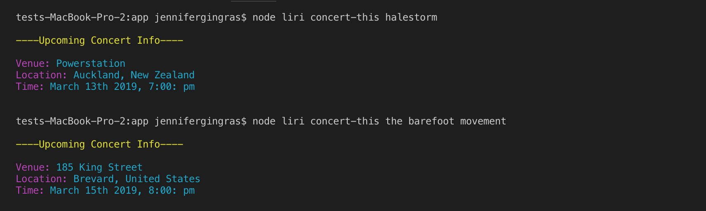
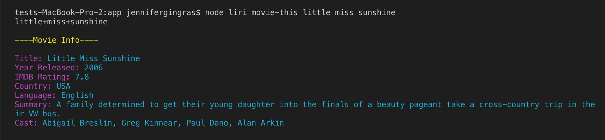

# Liri-node-app
a node app that searches the Bands in Town, Spotify and OMDB APIs

## **Okay, what does it do?**
This application allows a user to search for information on musicians, songs, and movies within the command line/terminal. 

## **And why would anyone do that?**
Because it makes hanging out in the terminal very exciting, despite the lack of visual appeal. It is also a great way to learn more about using the terminal, node.js and APIs. 

## **How does it work?**
LIRI stands for Language Interpretation and Recognition Interface. This application will take in a search parameter and return a set of data. The data from Bands in Town and OMDB is retrieved using Axios, while the Spotify data is retrieved using the Node-Spotify-API package. 

Retrieved data from **Bands in Town**
* Name of the venue
* Venue location
* Date of the Event

from **Spotify**
* Artist or band name
* Song title
* preview link of the song from Spotify
* Album title 

from **OMDB**
* Movie Title
* Year
* IMDB rating
* Rotten Tomatoes rating
* Country of origin
* Language
* Plot
* Actors

### **Useful Instructions**
LIRI runs on four commands which are type into the terminal. The four search commands and their parameters are:

* `spotify-this-song` + song title
* `movie-this` + movie title
* `concert-this` + artist/band name
* `do-what-it-says` (try it and find out what is says...)

The commands run like so: 
> `node liri.js <command> <search parameter>`

## See it in Action!

**Bands in Town**  
Search for single or multi-word artists and band names.

**Spotify**  
Search for a song title.

**OMDB**  
Search for a movie title.
 

If no search term is given the return defaults to "Mr. Nobody".

### Catching Input Errors
There are some error messages in place because user input isn't perfect.

If the command is typed in wrong:

If the title is mispelled:

